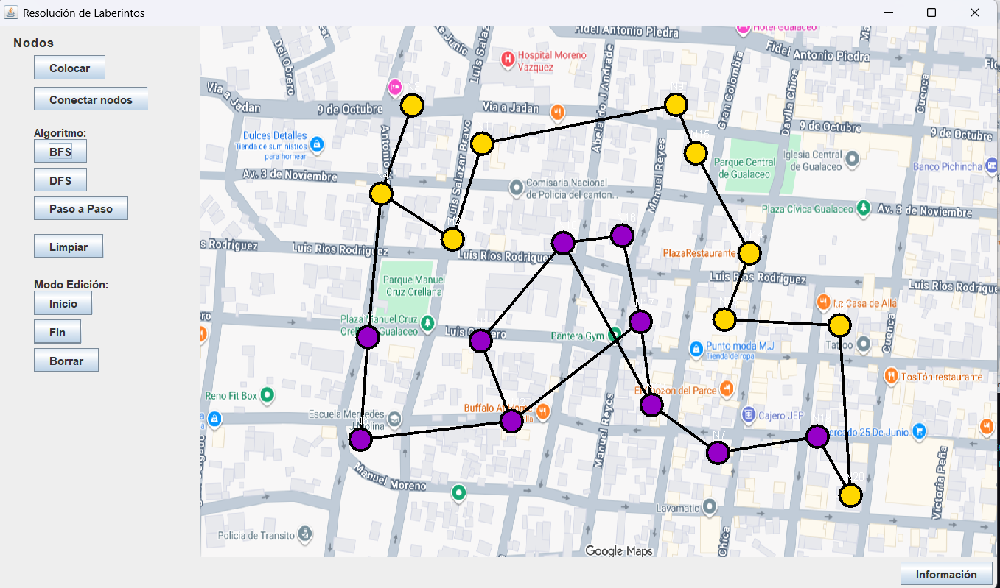
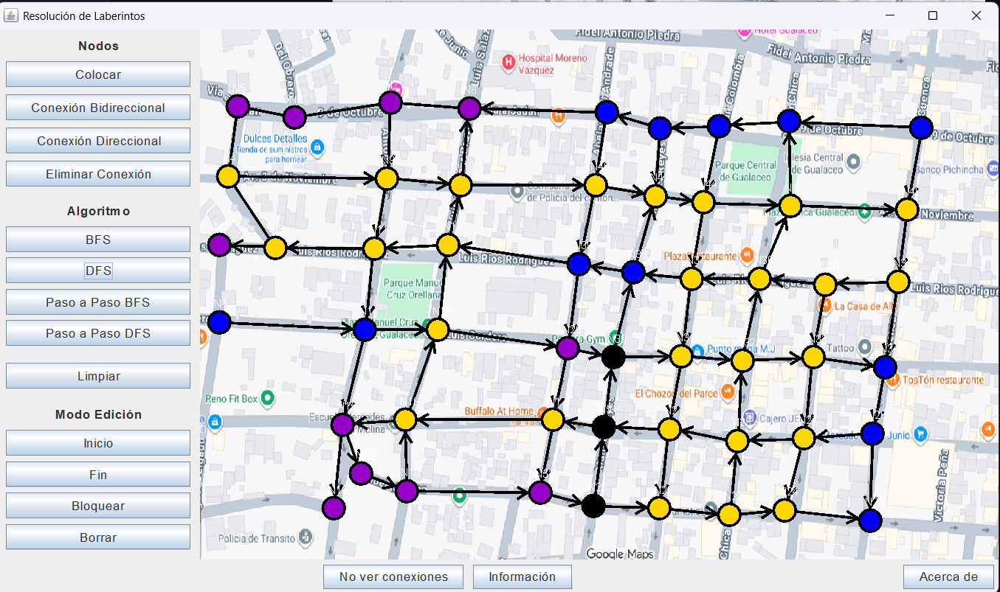

# Resolución de Laberintos con BFS y DFS


---

## Información General
- **Universidad:** Universidad Politecnica Salesiana 
- **Carrera:** Computacion / Ingeniera en Sistemas
- **Materia:** Estructura de Datos
- **Estudiante:** Jose Avecillas
- **Docente:** Ingeniero Pablo Torres
- **Periodo:** Periodo 67

---

## Descripción del Proyecto
- Crear un algoritmo con interfaz grafica que implemente metodos DFS y BFS en una interfaz grafica en una imagen de un mapa.


## Justificación Técnica

- El proyecto fue desarrollado para aplicar los conceptos de grafos,
nodos y algoritmos de búsqueda vistos en la asignatura de Estructura
de Datos, integrándolos en una aplicación gráfica interactiva. El uso de BFS y DFS permite analizar distintos enfoques de recorrido
en grafos, mientras que la visualización paso a paso facilita la
comprensión del comportamiento interno de cada algoritmo. 
---

## Objetivos
- Crear una interfaz grafica
- Implementar Nodos y Grafos
- Implementar DFS Y BFS


### Objetivo General

- Que la ejecucion de BFS Y DFS en nodos del mapa se ejecuten de una manera efectiva.
---

## Funcionalidades

- Colocación manual de nodos sobre un mapa
- Conexión de nodos para formar un grafo
- Selección de nodo inicio y nodo fin
- Resolución del laberinto con BFS y DFS
- Visualización paso a paso del recorrido

---

## Tecnologías Utilizadas

- Java
- Java Swing
- NetBeans
- Git / GitHub

---

## Estructura del Proyecto

```txt
src/
 ├─ ui/
 │   ├─ MainWindow.java
 │   └─ MapPanel.java
 ├─ controller/
 │   ├─ LaberintoController.java
 │   └─ AlgoritmosBusqueda.java
 ├─ models/
 │   ├─ Nodo.java
 │   ├─ Grafo.java
 │   └─ ResultadoBusqueda.java
 └─ assets/
     └─ Mapa.png
     └─ logoupscolor.svg
App.java
```

## Capturas de Pantalla de la Aplicación

### Interfaz principal y Nodos Conectados


### Ejecución de BFS


### Ejecución de DFS
